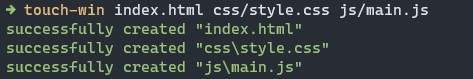

# 🧑‍💻 Touch Win

This project provides a simple and fast solution to create multiple files from a single command; Touch-win is inspired by the "touch" command found on Linux and UNIX based systems.



##  ✨ Features
- Allows you to create multiple files with a single command.
- Automatically creates the necessary folders for the location of the file to create if it does not exist.
- Allows you to create files from a base path

<!-- ## ⚡️ Requirements -->

## 📦 Installation
Install touch-win with your package manager:

#### NPM
```bash
npm install -g touch-win
```

## 🚀 Usage
```bash
touch-win --help
```

```bash
Usage: index.js [options] [file ...]

Options:
      --version  Show version number                                   [boolean]
  -h, --help     Show help                                             [boolean]
  -v, --verbose  Run with verbose logging             [boolean] [default: false]
  -b, --base     Base folder to place the file(s)                       [string]

Examples:
  index.js [options] [file ...]  Create file(s)
```

### Base
This option allows you to create files from a base path, this will help you not to repeat the same path in each file.

#### Example
```bash
touch-win --base src/components/new_component component.js style.sass
```
```bash
successfully created "src\components\new_component\style.sass"
successfully created "src\components\new_component\component.js"
```
___
**⚠️ WARNING:** This package is still under development, so it may have some bugs.