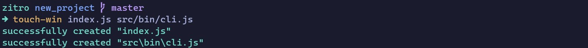

<br>
<br>

<!-- Basic information -->
<div align="center">
  <a href="github.com/zitrocode/touch-win">
    
  </a>
  <!-- <h3>Touch Win</h3> -->
  <br>
  <p>
    A tool that will allow you to create multiple files using the terminal in Windows.
  </p>
  <div align="center">
    <a href="https://github.com/sponsors/zitrocode">
      
    </a> 
    <a href="https://github.com/zitrocode/touch-win/network">
      
    </a>
    <a href="https://github.com/zitrocode/touch-win/stargazers">
      
    </a>
    <a href="https://github.com/zitrocode/touch-win/issues">
      
    </a>
    <a href="https://github.com/zitrocode/touch-win/blob/master/LICENSE">
      
    </a>
    <a href="https://www.linkedin.com/in/zitrocode">
      
    </a>
  </div>
  <br>
  <div align="center">
    <a href="https://github.com/zitrocode/touch-win/issues">
     <strong>Report Bug</strong>
    </a>
    ·
    <a href="https://github.com/zitrocode/touch-win/issues">
     <strong>Request Feature</strong>
    </a>
  </div>
</div>

---

<div align="center">
  
</div>
<br>

Touch win is a cli program that helps you create various files with a single command, it is inspired by the "touch" command found natively in Linux and Unix based operating systems. Even though there are several programs/packages in [npmjs](https://npmjs.com) that help you get this command on Windows, **I assure you that there is no one like it**.

## ✨ Features

- It allows you to generate multiple files with a single command.
- Create folders automatically if they don't exist.
- Allows you to generate files from a base path.
- Allows you to generate files from a template.

## 📦 Installation

Install touch-win with your package manager:

```bash
npm install -g touch-win
```

## 🚀 Usage

```bash
touch-win --help
```

```bash
Usage: touch-win [options] [file ...]

Options:
      --version   Show version number                                                               [boolean]
  -h, --help      Show help                                                                         [boolean]
  -v, --verbose   Run with verbose logging                                         [boolean] [default: false]
  -b, --base      Base folder to place the file(s)                                                   [string]
  -t, --template  Template to generate files                                                         [string]
Examples:
  touch-win [options] [file ...]                                                   Create file(s)

  touch-win src/bin/cli.js src/helpers/file.js src/helpers/directory.js            Standard use
```

As you have seen, **Touch Win** has some options that will help you create a new file:

### Examples

```bash
# Standard use
touch-win src/bin/cli.js src/helpers/file.js src/helpers/directory.js

# Return
successfully created "src\bin\cli.js"
successfully created "src\helpers\files.js"
successfully created "src\helpers\directory.js"
```

```bash
# Use with option "base"
touch-win --base src/components/new_component component.js style.sass

# return
successfully created "src\components\new_component\style.sass"
successfully created "src\components\new_component\component.js"
```

```bash
# Use with option "template"
touch-win --template src/components/NewComponent.[rf] js test.js css

# return
successfully created "src\components\NewComponent.js"
successfully created "src\components\NewComponent.test.js"
successfully created "src\components\NewComponent.css"
```

```bash
# Use with option "template"
touch-win --template config/webpack.[rf].js dev build common

# return
successfully created "config\webpack.dev.js"
successfully created "config\webpack.build.js"
successfully created "config\webpack.common.js"
```

---

⚠️ **WARNING**: This package is still under development, so it may have some bugs.
